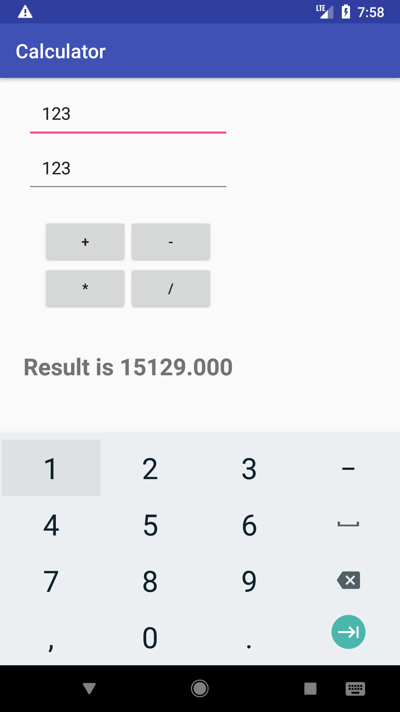

# Calculator Project
Now that you've done a few tutorials on Android development, you should create something of your own! Try to make an app that acts as a simple calculator. There are two text fields that you enter numbers into, and then +,-,*,/ buttons which will compute the results. Feel free to add more operations if you want! Here's a picture of what it could look like, but the layout is up to you!

